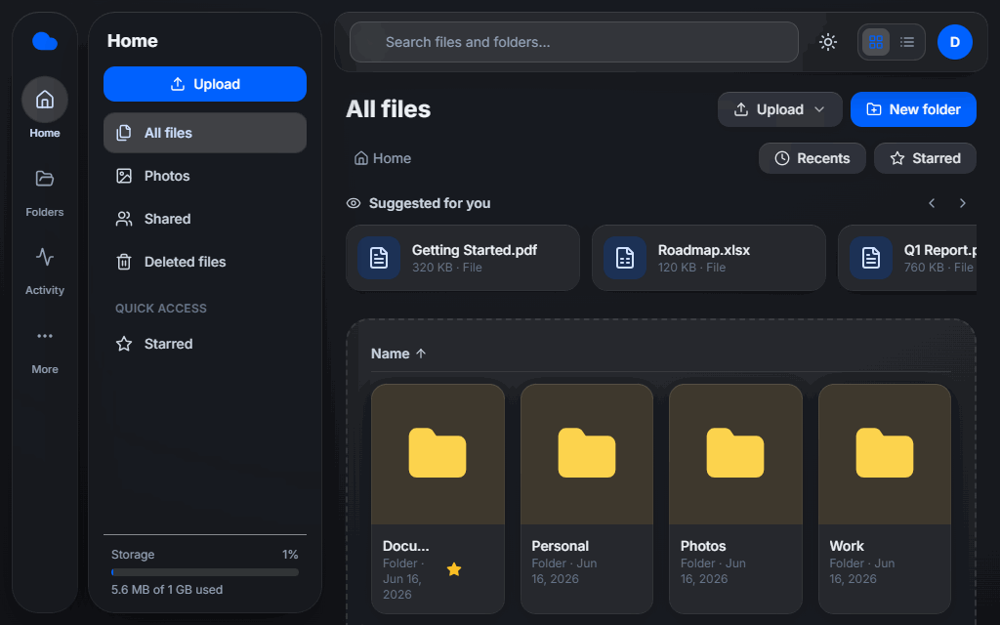
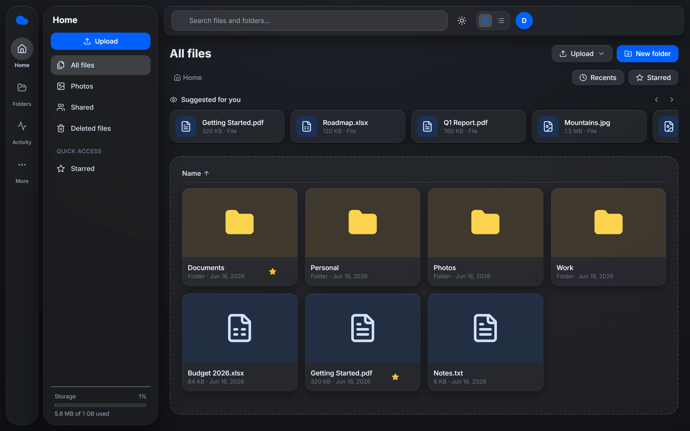
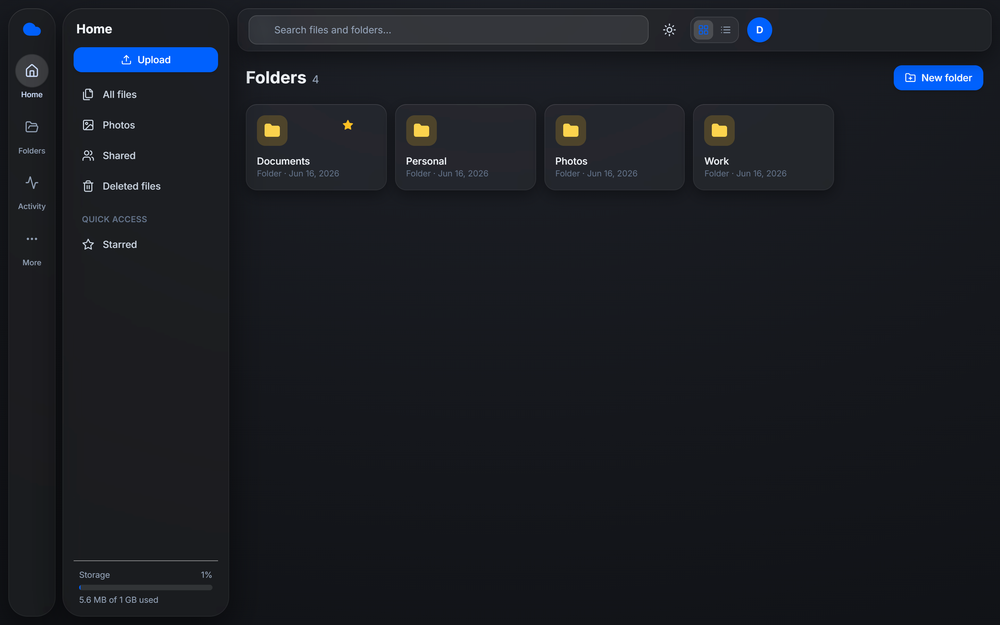
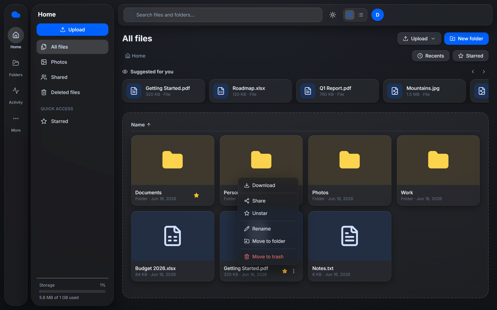
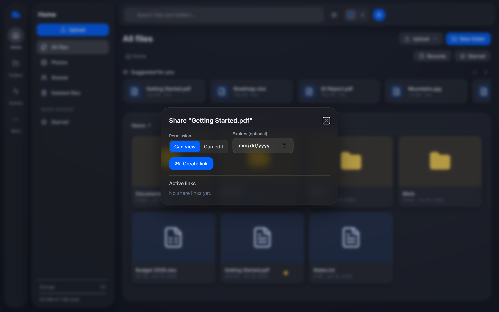
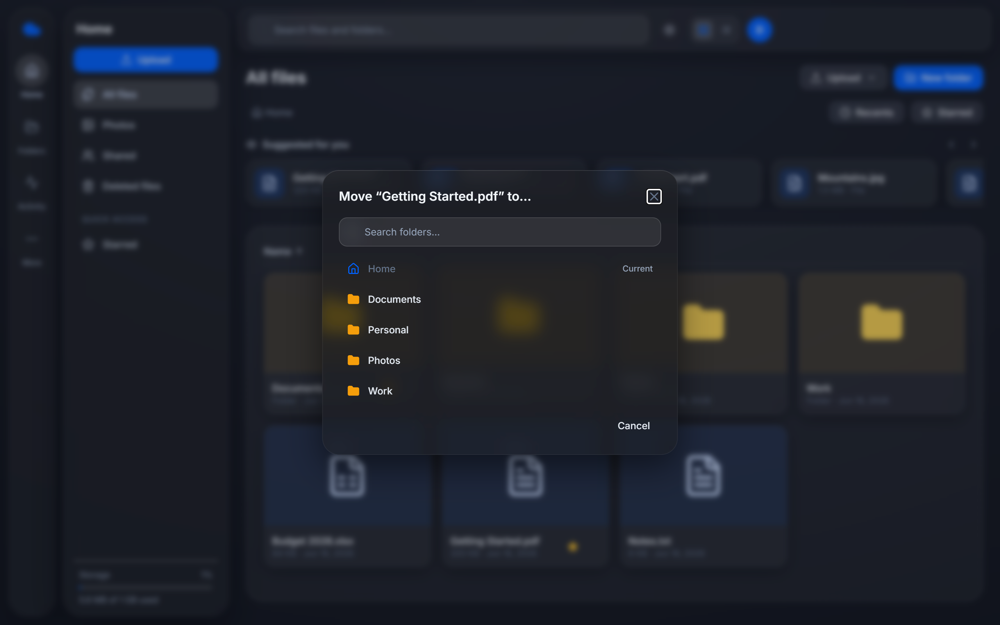
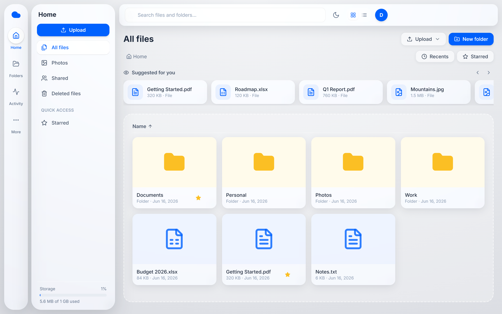

# ☁️ CloudBox

A Dropbox-style file storage service — **Spring Boot · React · MinIO · PostgreSQL · Docker**.

Upload, organize, preview, and share files through a clean **glassmorphism** web UI,
backed by a REST API that stores metadata in PostgreSQL and file bytes in
S3-compatible object storage (MinIO). The whole stack runs with one command.

<p align="center">
  
</p>

## ✨ Features

- 🔐 **Auth** — register / login with JWT, BCrypt-hashed passwords
- 📁 **Files & folders** — upload (drag-and-drop), download, nested folders, rename, move
- 🔎 **Search** files and folders by name
- ⭐ **Starred** items for quick access
- 🗑️ **Trash** — soft-delete with restore; permanent delete frees storage
- 🔗 **Sharing** — public share links with view/edit permission and optional expiry
- 👁️ **Preview** — images, PDFs, and text via short-lived presigned URLs
- 📦 **Storage quota** per user with a live usage meter
- 🧰 **Bulk actions**, recent files, list & grid views

## 📸 Screenshots

| Home — large tiles, “Suggested for you”, sortable | Folders view |
|---|---|
|  |  |
| **Sectioned actions menu** | **Share link — permission + expiry** |
|  |  |
| **Move to folder** | **Light theme** |
|  |  |

## 🏗️ Architecture

```
  Browser ──▶ React (Vite/nginx) ──REST + JWT──▶ Spring Boot API ──┬──▶ PostgreSQL (metadata)
                                                                    └──▶ MinIO (file bytes)
```

**Key idea:** metadata in Postgres, bytes in MinIO. Each file row stores an
`object_key` pointing at the object in MinIO. Storage sits behind a
`StorageService` interface, so swapping MinIO for AWS S3 / Cloudflare R2 is a
config change, not a rewrite.

## 🧱 Tech stack

| Layer          | Tech                                                  |
|----------------|-------------------------------------------------------|
| Backend        | Java 21, Spring Boot 3.3, Spring Security + JWT        |
| Metadata DB    | PostgreSQL 16 (schema via Flyway migrations)           |
| Object storage | MinIO (S3-compatible, AWS SDK v2)                      |
| Frontend       | React 18, Vite, TypeScript, Tailwind, Radix UI        |
| Data fetching  | TanStack Query + Axios                                 |
| Orchestration  | Docker + Docker Compose                                |
| Reverse proxy  | Caddy (auto HTTPS in production)                       |
| API docs       | springdoc-openapi (Swagger UI)                         |
| Tests / CI     | JUnit + Testcontainers, GitHub Actions                |

## 🚀 Quick start (local)

> Requires [Docker Desktop](https://www.docker.com/products/docker-desktop).

```bash
cp .env.example .env          # adjust values if you like
docker compose up --build     # postgres + minio + backend + frontend
```

Then open:

- **App:** http://localhost:3000
- Swagger UI: http://localhost:8080/swagger-ui.html
- MinIO console: http://localhost:9001 (`minioadmin` / `minioadmin`)

## 🧑‍💻 Developing without full Docker

Run infra in Docker, apps natively:

```bash
docker compose up postgres minio minio-init   # infra only

cd backend && mvn spring-boot:run             # API on :8080
cd frontend && npm install && npm run dev      # Vite dev server on :5173 (proxies /api)
```

## 🔑 Enable Google sign-in (optional)

Google login is built in but stays **disabled** until you add credentials — the
app runs fine on email/password without it.

1. Go to [Google Cloud Console → Credentials](https://console.cloud.google.com/apis/credentials).
2. **Create credentials → OAuth client ID** → application type **Web application**.
3. Add **Authorized redirect URI**: `http://localhost:8080/login/oauth2/code/google`
4. Add **Authorized JavaScript origins**: `http://localhost:3000` and `http://localhost:8080`
5. Copy the **Client ID** and **Client secret** into your `.env`:
   ```env
   GOOGLE_CLIENT_ID=xxxxxxxx.apps.googleusercontent.com
   GOOGLE_CLIENT_SECRET=xxxxxxxx
   ```
6. Restart the backend: `docker compose up -d backend`

A **"Continue with Google"** button then appears automatically on the login and
register pages. (The frontend shows it based on `GET /api/auth/config`.)

## ✅ Tests

```bash
cd backend && mvn verify     # unit + Testcontainers integration tests (needs Docker)
cd frontend && npm run build  # type-check + production build
```

CI runs both on every push via [GitHub Actions](.github/workflows/ci.yml).

## 🌐 API overview

| Method | Path | Description |
|--------|------|-------------|
| POST | `/api/auth/register` · `/api/auth/login` | Get a JWT |
| GET | `/api/auth/me` | Current user |
| GET | `/api/folders` · `/api/folders/{id}` | List root / folder contents + breadcrumbs |
| POST · PATCH · DELETE | `/api/folders…` | Create / rename·move·star / trash a folder |
| POST | `/api/files` | Multipart upload |
| GET | `/api/files/{id}/download` · `/preview-url` | Download / presigned preview URL |
| PATCH · DELETE | `/api/files/{id}` | Rename·move·star / trash |
| POST | `/api/files/{id}/restore` · `/api/files/bulk` | Restore / bulk actions |
| GET | `/api/search?q=` · `/api/files/recent` · `/api/starred` · `/api/trash` | Views |
| POST · GET · DELETE | `/api/shares…` | Create / resolve (public) / revoke share links |

Full, interactive docs at `/swagger-ui.html`.

## 📦 Deployment (free, $0)

The whole stack is one Docker Compose unit, so deployment is `git pull` +
`docker compose up`.

### Option A — single always-free VM (recommended)
Run the full prod stack on an **Oracle Cloud Always-Free** VM (or any small VPS).
Caddy provisions HTTPS automatically.

```bash
# on the server, with a DNS A record pointing at it
cp .env.example .env          # set strong POSTGRES_PASSWORD, JWT_SECRET, MINIO creds,
                              # DOMAIN=your.domain, PUBLIC_URL=https://your.domain
docker compose -f docker-compose.prod.yml up -d --build
```

### Option B — managed free tiers
Frontend on Vercel/Cloudflare Pages, backend on Render/Fly.io, Postgres on
Neon/Supabase, storage on Cloudflare R2. The Flyway schema and `StorageService`
interface make these drop-in swaps.

> Free tiers may cold-start when idle and have storage limits — fine for a demo.

## 🗂️ Project layout

```
.
├── backend/                  # Spring Boot API
│   └── src/main/java/com/cloudbox/
│       ├── auth/  user/  file/  share/  storage/  config/  common/
│   └── src/main/resources/db/migration/   # Flyway SQL
├── frontend/                 # React + Vite + Tailwind SPA
│   └── src/  (api/ auth/ components/ pages/ hooks/ lib/)
├── docker-compose.yml        # local dev stack
├── docker-compose.prod.yml   # production stack (+ Caddy)
├── Caddyfile
└── .github/workflows/ci.yml
```

## 📄 License

MIT
